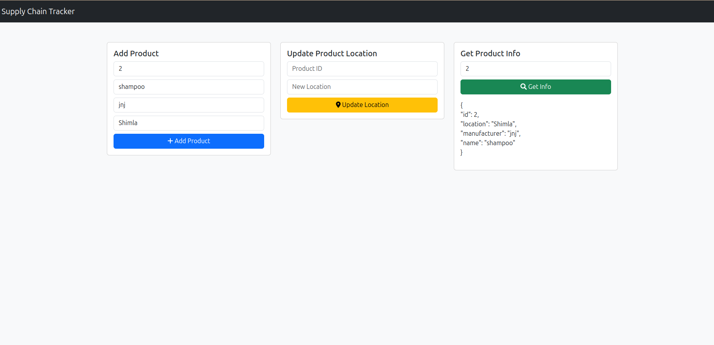

## Supple Chain Block Chain app

This is a demo Block chain app on Supply chain

this app enables user to add product id, product description and location

Once a product is added, then user can update the location enabling tracing of the product movement

User (supply chain manager) can fetch the current location of the project

No one can alter the product information

## Enhancements

More utilities

Multiple personals

AI/ML modules for predicting delays etc


```

```
